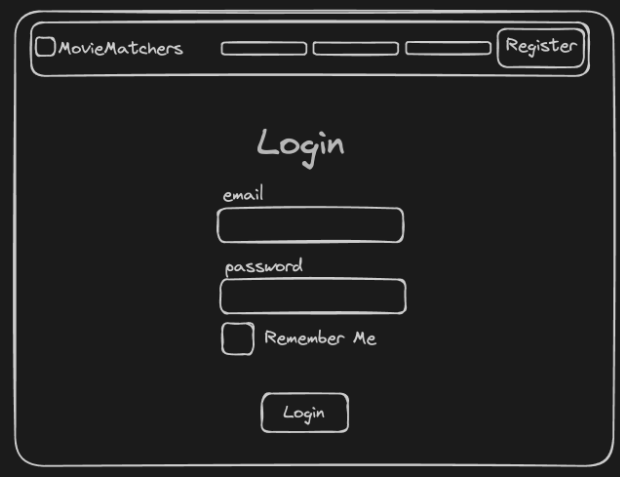
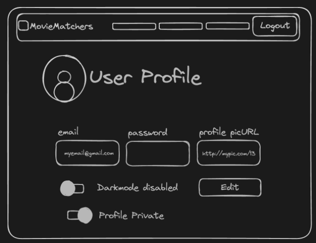
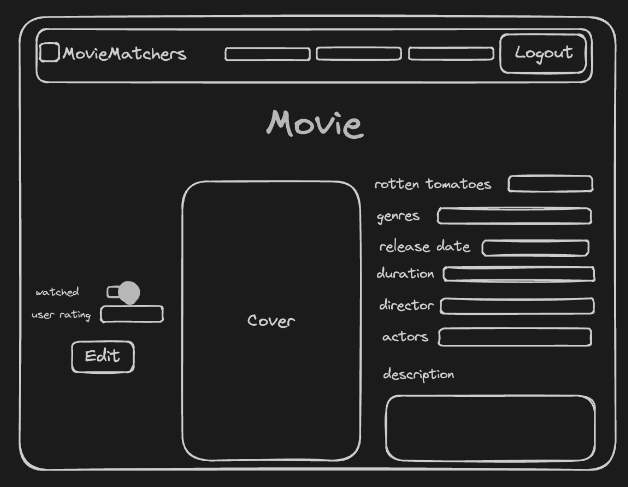
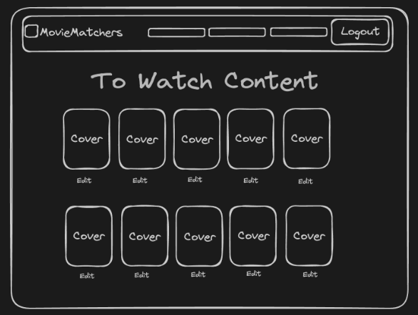
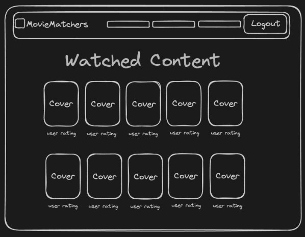
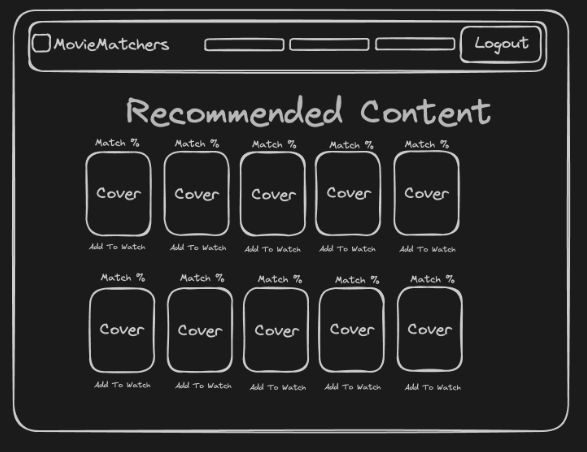

**Introduction**  
Introducing “Movie Matcher” - an application where you can track movies or tv shows you’ve watched, rate them after watching and we will recommend other movies/shows based on what you have watched. You can also connect with other people who have similar taste in movies.

This app is for: 
* People who are interested in remembering and rating what movies/shows they’ve watched.
* Individuals who want to connect with others who happen to have similar taste in consuming entertainment media.
* Avid movie watchers who want more movie/tv show recommendations based on previous viewings and ratings.

People are always looking to consume more content, it’s addictive. The issue is nobody ever knows what to watch! Look no further as Movie Matcher is here to bridge the gap, providing the simplistic solution to this specific problem.

**Core Functionality** 
* **Movie/tv tracking:** Users can search for movies/tv using the api and give them a rating.
* **User Connecting:** Users have the option to make their profile public to:
    * Allow for other users to connect with them via email (given if the profile is public).
    * Have account interests shown to other users ex: favorite genres, etc.
    * See others accounts and decide if they would want to reach out.
* **Movie/tv management:** Users can add to a list of content they want to watch
    * They can set the movie/tv show to watched once it’s viewed.
    * They can add a rating.
    * They can remove it from the list if they don’t want to watch it anymore
* **Recommendations:** Users will be recommended new content based on watched:
    * We will either have an api or small algorithm that finds similar movies/tv.
    * The user can add movie/tv to the list of to be watched.
    * The user can deny adding the movie/tv to watch based on stats.

**Requirements** 
User Stories: 
* **As a user**, I want to add movies I have watched to my list so I can keep track of what I have watched.
* **As a user**, I want to see a catalog of movies on a home screen,so that I can see what is new.
* **As a user**, I want to be able to sort my movies by genre, type (Tv, Movie), etc ,so that I can see the movie types that interest me more.
* **As a user**, I want to have a watchlist ,so that I can have a list of what movies are on my backlog. 
* **As a user**, I want to give a score to the movies I have watched ,so that I can have feedback on what my preferences and my recommendations might be.
* **As a user**, I want to be able to edit my watchlist,so that I can make sure movies I am no longer interested in aren’t there anymore. 
* **As a user**, I want to be able to seamlessly make a movie in my watchlist be added to my watched movies list, so that I can have my lists up to date. 
* **As a user,** I want to be able to edit my ratings of watched movies, so that I can accurately show my ratings if I rewatch something.
* **As a user**, I want to be able to register an account, so that I can keep track of the movies I have watched and want to watch.
* **As a user**, I want to log into my account, so that I can access my movie lists.
* **As a user**, I want to log out of my account, so that I can securely end my session.
* **As a user**, I want to be able to connect with other people based on movie ratings,so that I can have new friends to watch movies/tv with.
* **As a user**, I want to be able to hide my watched movies and movie ratings, so that I can stay private because I only want to track my own stuff.  

**API Routes** 
| Request | Action | Response | Description |
| -------- | -------- | -------- | -------- |
| POST /content     | ContentController::addContent     | 200 /content/:id     | Add a movie to the database that the user searched for through the API|
| GET /content      | ContentController::getContentList |200 ContentCatalogView| Show the content that the database already has available to select from. |
| GET /watched_content  | UserController:getWatchedList |200 WatchedView    | Show the watched list of the user                            |
|GET /to_watch_content|UserController::getToWatchList |200 ToWatchVIew |Show the to watch list of the user                           |
|GET /watched_content | UserController::getToWatchList    |404 ErrorView |Displays error if user tries to view someone else’s profile who is private.  |
|GET /to_watch_content |UserController::getWatchedList  |404 ErrorView | Displays error if user tries to view someone else’s profile who is private. |
|POST /register |UserController::register|201 /login|Creates a user profile|
|POST /watched_content|UserController::addContentWatchedList|200 /user/:id/watched_content| Adds content to the watched list of the user |
|GET /add_watched_content|UserController::getAddWatchedContentForm|200 NewWatchedContentFormView|Gets a form to add watched content and give a rating|
|POST /to_watch_content|UserController::addContentToWatchList|200 /user/:id/to_watch_content|Adds content to the to watch list of the user|
|GET /add_to_watc_content|UserController::getAddToWatchContentForm|200 NewToWatchContentFormView|Gets a form to add to watch content.|
|GET /login|UserController::getLoginForm|200 LoginFormView|Shows the login form|
|POST /login/:id|UserController::login|200 /user/:id/add_watched_content|Once user is logged in they are sent to add watched content|
|GET /register|UserController::getRegisterForm|200 RegisterFormView|Shows the register form views|
|GET /content/:id|ContentController::getContent|200 ContentView|Shows details about specific content |
|GET /content/:id|ContentController::getContent|404 ErrorView|Displays an error if the content does not exist|
|GET /profile|UserController::getProfile|200 UserProfileView|Gets the profile of the user. Hides most information if the user wants their account private.|
|GET /profile|UserController::getProfile|404 ErrorView|Displays an error if the user does not exist |
|GET /recommended_content|UserController::getRecommendedContent |200 RecommendedContentView |Displays the list of recommended content of the user|
|PUT /recommended_content|UserController::getRecommendedContent|400 ErrorView|Displays an error because users cannot edit their recommended list|

**Images**  
 
The login view is the initial screen where users can enter their credentials to log into their account. It typically consists of a form with input fields for the username/email and password, along with a “Login” button. The login view should also include a link to the registration page for new users who don’t have an account yet.

---

 
The user profile shows the user’s profile picture if set, and gives them a place where they can update their email, password profile picture and if their profile is public or private. Here is also where they can control if the site is displayed in light or dark mode depending on the value of the toggle switch.

---

 
The movie page shows a certain movie that user clicked on. The user can toggle if they've watched it or not, give a rating and edit a rating they gave. It also shows the rotten tomatoes, genres, release date, duration, director, main actors, cover and a description of the movie. It will also have a button to add to to watch.

---

 
The to watch page shows content user has added to the to watch via recommended content page. It will show the cover and name of each movie and the user can click on the cover or the edit button to go to the movie page for more info or to edit the watched status or rating.

---

 
The watched content page if for users who want to see what they have watched and what they rated it so that they can recommend stuff to firends, the user can also edit the rating they gave it by clicking on the cover.

---

 
The recommended content page will show users movies that our algorithm or api thinks they would like. The user can scroll through and see the match % of each movie the cover and title. There will also be a button that the user can click to add it to their to watch page. There will be a notification that the movie was added.
